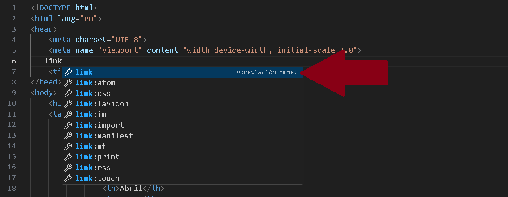
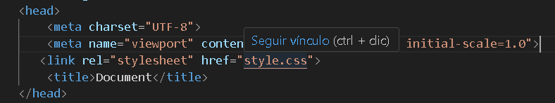
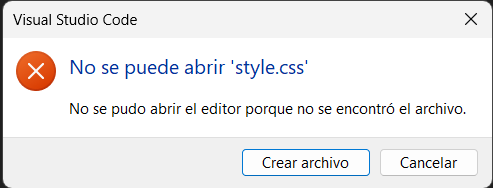
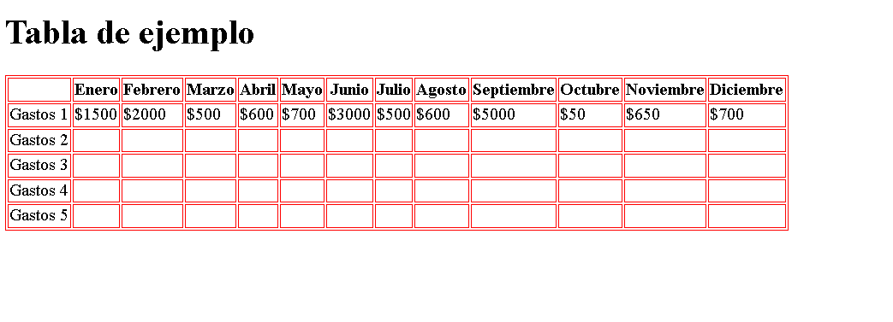
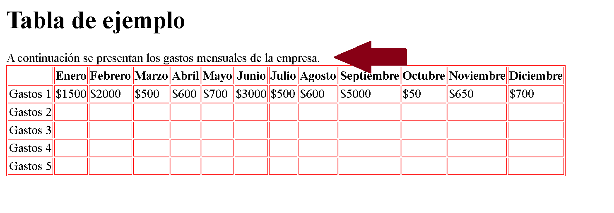
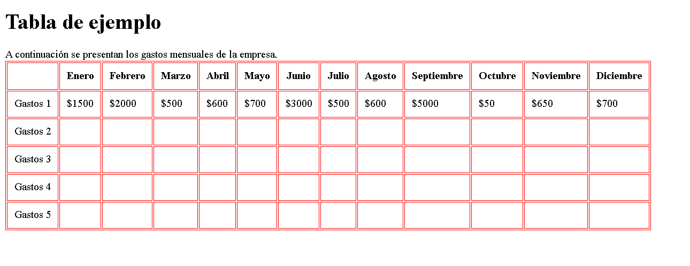

<div style="text-align: justify">

# CSS - Tablas.

## Introducción

**¿Qué significa `CSS`?**

En nuestro documento `HTML`, utilizaremos la etiqueta `link`. Dentro de esta etiqueta se emplean dos atributos principales: `href` y `rel`.

- En el atributo `href`, entre comillas, escribiremos el nombre del archivo que contiene nuestras reglas de estilo. Este archivo debe tener extensión `.css`.

- En el atributo `rel`, también entre comillas, colocaremos la palabra **stylesheet**, que en inglés significa *hojas de estilo*.

De esta manera, el archivo `CSS` quedará correctamente vinculado con el documento `HTML`.

En el siguiente código podrás ver un ejemplo:

```HTML
   <link rel="stylesheet" href="style.css">
```

Una vez que el archivo `CSS` esté vinculado desde nuestro documento `HTML`, procederemos a crear un nuevo archivo y lo guardaremos con el nombre **style.css**.

Dentro de este archivo comenzaremos a escribir nuestras reglas de `CSS`, que serán las encargadas de definir los estilos visuales de la páginas web.

> Otra alternativa es simplemente escribir la palabra `link` dentro de nuestro código `HTML`.

> De esta manera, `Visual Studio Code` mostrará un menú desplegable con diferentes opciones, lo que nos facilitará completar la etiqueta de manera más rápida y correcta.

<div style="text-align: center">



</div>

En este caso, simplemente hacemos clic en la opción `link:css`, y automáticamente se generará el vínculo.

```html
<link rel="stylesheet" href="style.css">
```
Para completar el proceso, solo nos queda crear el documento `style.css`. Para hacerlo, mantenemos presionada la tecla `Ctrl` y hacemos clic en el archivo vinculado en el atributo `href`.

<div style="text-align: center">



</div>

Una vez que hagamos clic, aparecerá la siguiente ventana:

<div style="text-align:center">



</div>

Lo primero que haremos será asignar un borde a las etiquetas `table`, `td` y `th`. Para lograrlo, las referenciaremos desde el archivo `CSS` escribiendo los nombres de las etiquetas separadas por comas, es decir: `table, td, th`. Luego abriremos un bloque de código con llaves `{}` para definir las porpiedades correspondientes. Observá el siguiente ejemplo:

```CSS
    table, th, td
        {
           
        }
```
Una vez armada esta estructura, dentro de las llaves escribimos la propiedad **border**. Primero, indicaremos que se trata de un borde sólido con la instrucción: `border: solid;`. Luego, declararemos el **color** del borde, que este caso será rojo: `border: solid red;`. Finalmente, añadiremos el ancho de las líneas, estableciéndolo en un píxel: `border: solid red 1px;`.

El código completo nos quedará de la siguiente manera:

```css
    table, th, td
        {
            border: solid red 1px;
        }
```

*Documento*

<div style="text-align:center">



</div>

Agregaremos dentro de la etiqueta `tfoot` el siguiente texto: *A continuación se presentan los gastos mensuales de la empresa*.

```html
       </tbody>
       <tfoot>
            A continuación se presentan los gatos mensaules de la empresa.
       </tfoot>
    </table>

```
<div style="text-align:center">



</div>

Una curiosidad sobre la etiqueta `tfoot` es que, aunque aparece visualmente al final de una tabla en el navegador, en el código `HTML` puede colocarse antes de `tbody`.

Como podemos observar, la tabla ya cuenta con bordes, pero los datos que se encuentran dentro de ella están demasiado juntos. Para mejorar la presentación, vamos a darle un espaciado interno (relleno) de `10px` en la parte superior, inferior, izquierda y derecha de cada celda.

Parra lograrlo, utilizaremos la propiedad `padding`, asignándole el valor de `10px`. Esta propiedad la aplicaremos únicamente a las etiquetas `th` y `td`.

```CSS
    table, th, td
        {
            border: solid red 1px;
        }
    th, td
        {
            padding: 10px;
        }
```
*Padding traducido al español significa `relleno`*

*Documento final*

<div style="text-align:center">



</div>
</div>